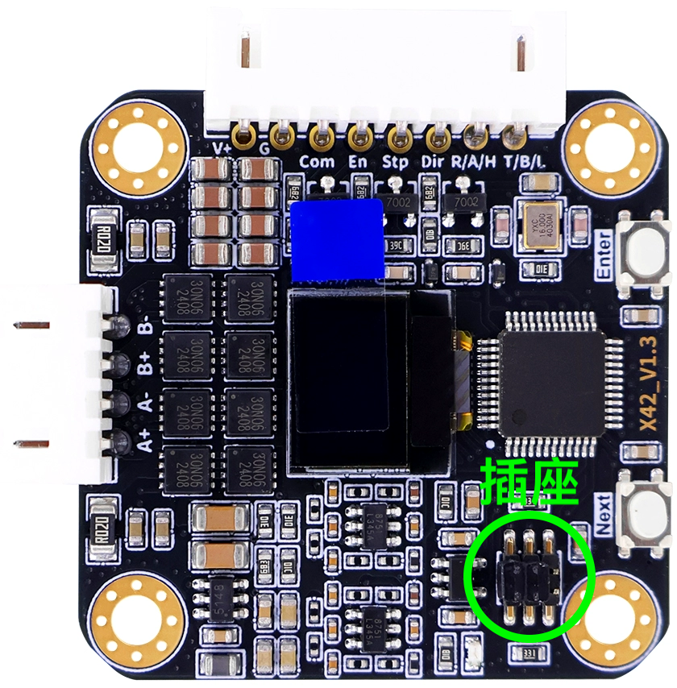
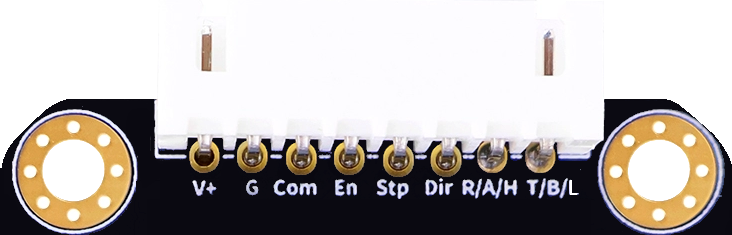
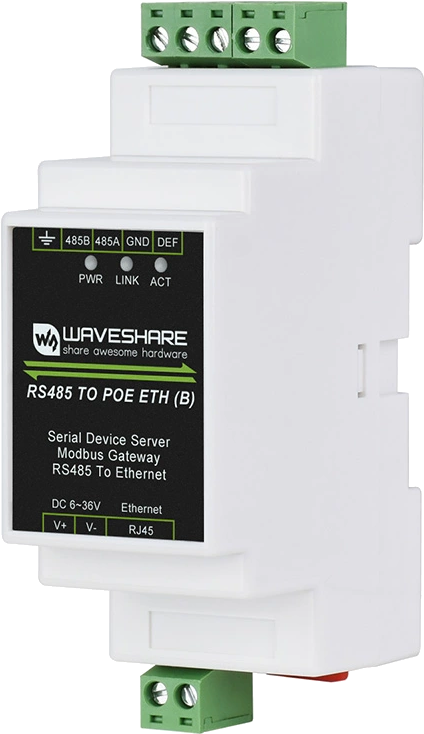
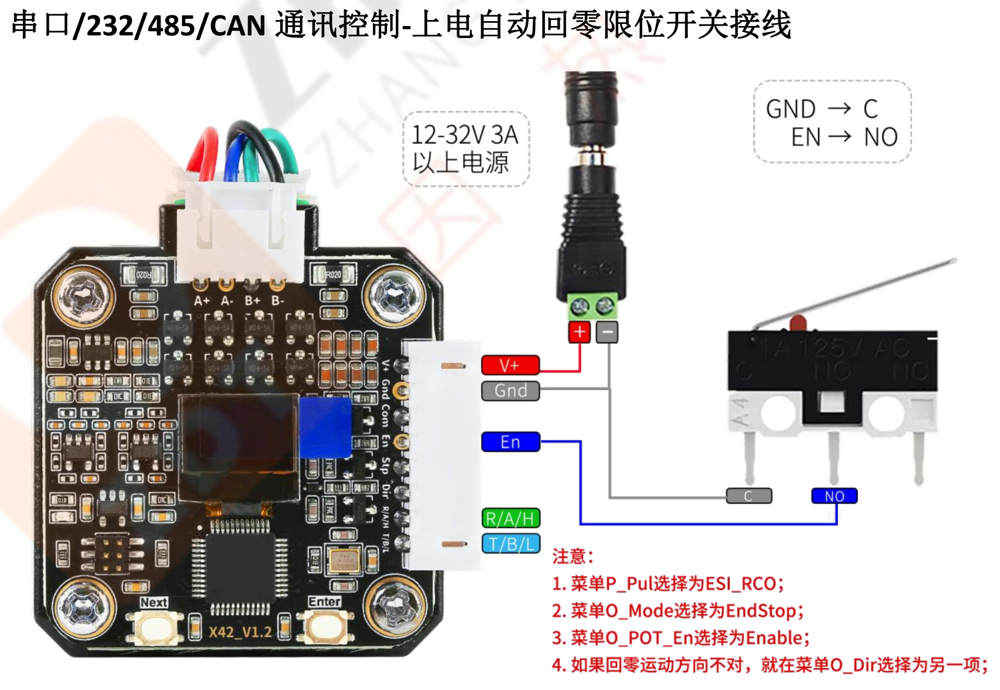
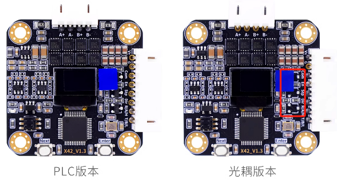

## 张大头步进电机闭环驱动器Python驱动程序
* 本驱动配合带有RS485通讯模块的各规格张大头闭环驱动器，稍作改造也可用于通过TTL/CAN/RS232控制驱动器。
### 闭环驱动器硬件
* 按照电机尺寸有 28 / 35 / 42 / 57四种规格销售。
* 按控制方式分脉冲控制和TTL/CAN/RS485/RS232通讯协议控制。
  * 其中脉冲控制和TTL不需要额外硬件，保持插座上的跳线帽原位不动
  </br></img>
  * RS485/RS232/CAN需要采购额外电路板，取代插座上的跳线帽。
  * Pinout
  </br></img>
### 树莓派进行RS485通讯需要的额外硬件
* RS485 TO POE ETH (B)，是一个Ethernet到RS485的透明传输模块。
  </br></img>
* 这款RS485收发模块使用守则是：树莓派通过RJ45网口的Ethernet向IP地址192.168.1.200，端口4196发送TCP消息，则消息被翻译并发送到RS485总线上。
### 本驱动程序
* 本驱动为Python库
### Usage
* Clone the repo
  ```sh
  git clone https://github.com/xg590/Learn_ZDT
  ```
* Use it 
  ```py
  import sys
  sys.path.append('/var/www/html/Learn_ZDT')
  from zdt import ZDTv13
  sMot = ZDTv13()
  _ , sMot.pul_cnt = sMot.getPulCnt(0x01) 
  sMot.moveByPulseCount(addr=0x01, Dir='CW', velo=500, pul_cnt=6400, mode='A')
  ```
### 说明
#### 关于方向
* 张大头驱动器手册上一律在方向相关的命令中，将0x00称作CW，即顺时针，0x01称作CCW，即逆时针，但实际并非如此。
* 例如，若菜单里Dir设置为CCW，位置模式控制命令里Dir字段的0x00真如手册里声称的代表CW吗？不，实际上，如果Dir设置为CCW，控制命令里Dir字段的0x00表示按CCW转；如果Dir设置为CW，控制命令里Dir字段的0x00表示电机按CW转。也就是说，菜单里设置的电机旋转方向Dir不一样，同一条控制命令会让电机向不同方向转。
#### 7.3 多圈有限位开关回零操作说明
* 前置设置需要
  * P_Pul   : ESI_RCO # 复用为限位输入和到位输出
  * O_Mode  : EndStop # 多圈有限位开关回零
  * O_POT_En: Enable  # 上电自动触发回零功能
</img>
#### 关于工业光耦隔离版
* 如何知道是否是光耦隔离版本: 光耦版本少三个元件</br>
  </img>
* 光耦隔离版如何有限位回零：需要Com口供电，供5～24VDC就行，不供电En的限位无效。